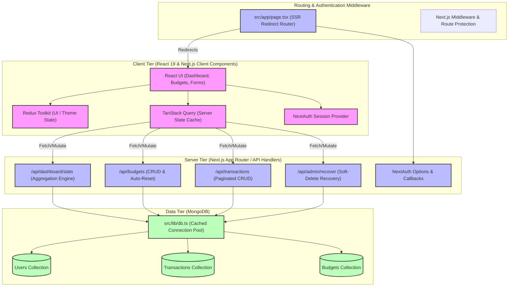

# 📊 Budget Planner - Full Project Architecture & Deep Technical Guide

A high-performance, minimalist, production-ready budget planning and financial tracking application. Built with a modern, state-of-the-art tech stack: **Next.js 16.2.6 (App Router)**, **React 19.2.4**, **MongoDB (Mongoose)**, **Redux Toolkit**, **TanStack Query (v5)**, and **NextAuth.js v4**.

This document provides an in-depth technical analysis of the application's full architecture, database design, server-side aggregation pipelines, client-side state engines, and complex logic flow across all files.

---

## 🏗️ 1. High-Level Architecture & System Layout

The application utilizes a hybrid architecture that blends the best of Server-Side Rendering (SSR), Server Components, Client-Side State Management, and Next.js Route Handlers.



---

## 🗄️ 2. Core Database Schema Specifications (`src/models`)

All collections are strongly typed using TypeScript interfaces and mapped via Mongoose schemas. To prevent database bloating and support safety features, **soft-deletion (`isDeleted`)** is natively implemented on transaction and budget collections.

### 👤 A. User Model (`src/models/User.ts`)
Stores identity, hashed credentials, and role-based permissions (`USER` or `ADMIN`).
* **Validation**: Email validation is enforced via standard regex.
* **Complex Logic**:
  - `role` defaults to `'USER'`. It determines view capabilities on the `/dashboard/admin` panel.
  - Automatically indexes the `email` field for high-performance retrieval during authentication.

### 💸 B. Transaction Model (`src/models/Transaction.ts`)
Stores every transactional debit and credit.
* **Fields**:
  - `userId` (ObjectId referencing `User`): Creates a one-to-many relationship. Heavily indexed to fetch transactions specific to the logged-in user in sub-millisecond durations.
  - `type` (`income` | `expense`): Restricts input via Mongoose enum.
  - `amount`: Non-negative floating number.
  - `category`: String representing categories (e.g. Food, Salary).
  - `date`: Timestamp representing when the transaction took place.
  - `isDeleted`: Boolean flag that hides transactions from normal user dashboards while allowing the Admin panel to recover them.

### 🎯 C. Budget Model (`src/models/Budget.ts`)
Stores the monthly limits defined by the user per category.
* **Unique Compound Index**: 
  A compound index on `{ userId: 1, category: 1, month: 1, year: 1 }` guarantees that a user cannot have duplicate budget configurations for the same category in the same month.
* **Fields**:
  - `limit`: The target maximum spending limit.
  - `month` (1-12) & `year`: Timeframes specifying the budget cycle.
  - `isDeleted`: Soft deletion flag.

---

## ⚡ 3. Complex Server-Side Logic (`src/app/api`)

### 🔐 A. Authentication & Session Lifecycles (`src/lib/auth.ts`)
Uses NextAuth's `CredentialsProvider` to secure the system.
* **Complex Logic (Role-Based JWT Extension)**:
  By default, NextAuth's `session.user` schema only holds `name`, `email`, and `image`. To facilitate role-based authorization, the authentication pipeline overrides JWT and Session hooks:
  ```typescript
  async jwt({ token, user }) {
    if (user) {
      // Extract custom attributes from the MongoDB document and inject them into the JWT token
      token.role = (user as { role?: string }).role;
      token.id = user.id;
    }
    return token;
  },
  async session({ session, token }) {
    if (session.user) {
      // Cast the default user session to include role and id properties
      const u = session.user as { role?: string; id?: string };
      u.role = token.role as string;
      u.id = token.id as string;
    }
    return session;
  }
  ```

### 📈 B. Real-Time Financial Aggregation (`/api/dashboard/stats`)
Calculates the user's active income, expense, and recent transactions based on a user-selected mode (`monthly`, `yearly`, or `total` date-range).
* **Complex Logic (MongoDB Aggregation Pipeline)**:
  Instead of fetching all transactions and calculating sums in Node.js (which is highly inefficient and risks memory exhaustion), the API executes a custom MongoDB `$match` and `$group` pipeline:
  ```typescript
  const getStats = async (start?: Date, end?: Date) => {
    // Construct dynamic filter conditions based on user inputs
    const match: { userId: mongoose.Types.ObjectId; isDeleted: boolean; date?: { $gte?: Date; $lte?: Date } } = { 
      userId, 
      isDeleted: false 
    };
    if (start || end) {
      match.date = {};
      if (start) match.date.$gte = start;
      if (end) match.date.$lte = end;
    }

    // Execute high-speed native aggregation on the database instance
    const result = await Transaction.aggregate([
      { $match: match },
      {
        $group: {
          _id: '$type',               // Group by transaction category (income or expense)
          total: { $sum: '$amount' }, // Efficiently sum the amounts
        },
      },
    ]);

    const income = result.find((s) => s._id === 'income')?.total || 0;
    const expenses = result.find((s) => s._id === 'expense')?.total || 0;
    return { income, expenses, balance: income - expenses };
  };
  ```

### 🔄 C. Idempotent Budget Rolling Engine (`/api/budgets/auto-reset`)
Automatically duplicates the previous month's budget settings into the current month.
* **Complex Logic**:
  This action must be completely **idempotent**. If the user runs this multiple times, it must not duplicate rows or overwrite current customized budgets:
  1. Checks if any active budget rows already exist for the current month. If `countDocuments > 0`, it triggers an early return.
  2. Calculates the exact previous month boundary (taking into account year rollover when the month is January).
  3. Queries the previous month's budgets.
  4. Generates standard current month rows and uses `Budget.insertMany(newBudgets, { ordered: false })` to insert them in bulk, skipping index failures.

### 🗑️ D. Soft Delete & Recovery API (`/api/admin/recover`)
Enables administrators to see all soft-deleted records across the entire application and selectively restore them with a single click.
* **Complex Logic**:
  Only admin accounts (`role === 'ADMIN'`) can access GET/POST methods in this file. The endpoint parses filters, searches for corresponding user IDs via a case-insensitive regex on user emails, queries soft-deleted items (`isDeleted: true`), and allows restoring them by updating the flag back to `false`.

---

## 🎨 4. Complex Client-Side State and UX (`src/app` & `src/components`)

### ⚡ A. SSR Redirect Router (`src/app/page.tsx`)
Rather than displaying a heavy landing page, the application uses Next.js server-side routing to immediately direct users where they need to go, resulting in a zero-hydration-flash experience:
```typescript
import { redirect } from 'next/navigation';
import { getServerSession } from 'next-auth';
import { authOptions } from '@/lib/auth';

export default async function Home() {
  const session = await getServerSession(authOptions);

  if (session) {
    redirect('/dashboard');
  } else {
    redirect('/login');
  }
}
```

### 📊 B. React 19 Hydration Gate & Recharts Type Safety (`src/app/dashboard/page.tsx`)
Recharts cannot be cleanly rendered on the server due to browser measurements requirements. 
* **Complex Logic (Hydration Gate)**:
  We implement client-side mounting gates using `useEffect` with ESLint rules locally suppressed to bypass re-rendering warnings:
  ```typescript
  // eslint-disable-next-line react-hooks/set-state-in-effect
  setMounted(true);
  ```
* **Complex Logic (Recharts Type Safety)**:
  Under React 19 and strict TypeScript mode, the Recharts `<Bar>` component passes its data argument down as `unknown`. To compile successfully without resorting to unsafe `any` casts (which violate `@typescript-eslint/no-explicit-any`), the parameters are parsed as `unknown` and casted inline:
  ```typescript
  <Bar
    dataKey={(d: unknown) => {
      const item = d as { name: string; value: number };
      return item.name === 'Income' ? item.value : 0;
    }}
    name="Income"
    fill="var(--chart-income)"
    radius={[4, 4, 0, 0]}
  />
  ```

### 📱 C. Fully Mobile-Responsive Filters Layout (`src/components/dashboard/DashboardFilters.tsx`)
On narrow screen widths, standard range filters cause layout clipping or scroll behaviors. The filter system uses responsive Tailwind layout triggers:
* **Mobile Viewports (< 640px)**: Transitions to `flex flex-col items-stretch w-full`. The calendar inputs scale to fill the viewport (`w-full`), making dates extremely easy to select.
* **Desktop Viewports (>= 640px)**: Transitions cleanly back to horizontal layout alignment (`sm:flex-row sm:items-center sm:w-auto`), preserving a compact, professional dashboard appearance.

---

## 🎛️ 5. Unified Client-Side Services Layer (`src/services`)

Rather than letting components initiate direct HTTP/fetch calls, the application abstracts all network requests into a **modular, strongly-typed services layer**. 

This services layer consists of:

### A. Central API Client (`src/services/apiClient.ts`)
A clean generic wrapper over the native `fetch` API. It automatically:
- Formats requests to use JSON headers.
- Handles empty responses (e.g., status 204 or 205).
- Checks response status codes and throws rich, custom `ApiError` instances if `response.ok` is false, automatically parsing server-returned error messages.

### B. Domain Service Modules
- **`authService`**: Manages client-side user registration.
- **`dashboardService`**: Strongly types stats parameters and response graphs data.
- **`transactionService`**: Encapsulates paginated transaction fetching, creation, and soft deletion.
- **`budgetService`**: Coordinates monthly thresholds checking, limits CRUD, and silent auto-reset requests.
- **`userService`**: Purges account transaction and budget listings.
- **`adminService`**: Enables admins to retrieve and recover soft-deleted collections.

---

## 🔄 6. State Management System Flow

The application divides state into two specialized layers:

```
                  ┌──────────────────────────────────────────┐
                  │          Client User Interface           │
                  └────────────────────┬─────────────────────┘
                                       │
                ┌──────────────────────┴──────────────────────┐
                ▼                                             ▼
  ┌───────────────────────────┐                 ┌───────────────────────────┐
  │      Redux Toolkit        │                 │      TanStack Query       │
  ├───────────────────────────┤                 ├───────────────────────────┤
  │ Manages client-side UI    │                 │ Manages server-side sync  │
  │ state like theme, toggle  │                 │ and caching of dashboards │
  │ sidebars, notifications.  │                 │ transactions, & budgets.  │
  └───────────────────────────┘                 └───────────────────────────┘
```

1. **Redux Toolkit (`src/store`)**:
   - Holds client-side UI configurations (e.g. `isSidebarOpen`, `theme`).
   - Slices like `uiSlice` listen to user transitions (e.g. dark/light toggles) and apply corresponding class names to the HTML root node.
2. **TanStack Query (v5)**:
   - Holds server-synchronized cache (dashboard queries, transactions, and category budget limits).
   - Whenever transactions are created or deleted, TanStack Query automatically triggers cache invalidation (`queryClient.invalidateQueries`), keeping the dashboard and charts in perfect sync.

---

## 🚀 7. Performance & Security Best Practices
- **Cached Database Connection Pool (`src/lib/db.ts`)**: Prevents serverless environment connection spikes by caching mongoose connections in the Node `global` space during hot reloads.
- **Password Hashing**: Natively processes credentials with `bcryptjs` using `12` salt rounds.
- **Automatic Compound Indexing**: Keeps queries fast by mapping key lookup parameters directly to MongoDB index maps.
